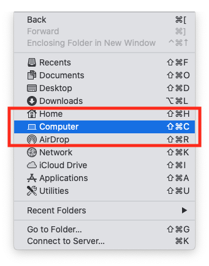

# A quickstart guide to CLI plotting on a Mac (Using Terminal)

This is a rough draft for plotting via Terminal on a Mac. If you run into any issues, please message me directly so I can clarify the instructions. This assumes no experience using Terminal.

1. Install the Chia app and run it (this will create your wallet, private keys, etc.)
2. Let's open Terminal and update the shell to use `bash` (for simplicity)
    * Open Preferences (Terminal -> Preferences, or use the keyboard shortcut `⌘ + ,`)
    * Under `General`, select `Command (complete path):` and update the value to `/bin/bash` 

Your preferences should look like:

4. Close Preferences.
5. If a Terminal window is open, close it.
5. Open a new Terminal window (`Shell -> New Window -> New Window With Profile` or `⌘ + n`)
6. Type `echo $0`. This should return `-bash`. If it returns `sh` or `zsh`, check your Terminal Preferences above.

## Adding Chia to `$PATH`

1. Copy and paste the following: `echo export PATH=/Applications/Chia.app/Contents/Resources/app.asar.unpacked/daemon:$PATH >> ~/.bash_profile`, and then hit Enter.
2. Type `source ~/.bash_profile`
3. Type `chia version`. This should return `1.1.2` (the latest version at the time of writing this)

## Determine your temporary and destination drives

As a Chia Farmer, you'll ideally have two drives: A temp drive and a destination drive. Your temp drive should be fast (ssd/nvme) while your destination drive can be slow (external drive)

NOTE: You do not want to plot to your internal ssd, especially for a Mac Mini M1.

Let's grab the path(s) to your drives.

1. If Terminal isn't open, open Terminal
2. Open a Finder window
3. In the menu, click `Go -> Computer`

4. Find your external drive, and drag it onto Terminal. This will return a path, similar to: `/Volumes/{YOUR_DRIVE_NAME}`

### TIP:
The other, simpler way, is to type `/V` and hit `TAB`. You should see Terminal auto-complete to `/Volumes/`. If your external drive is called `Chad`, type `C` then `TAB`. It should autocomplete `/Volumes/Chad/`. If you have multiple drives that start with `C`, Terminal will list all possible paths. Continue typing to further narrow the name.

## Time to plot

1. Let's verify Chia is installed properly. Type `chia keys show`

It should return something similar to:

    Showing all private keys:
    
    Fingerprint: XXXXXXXXX
    Master public key (m): XXXXXXXXXX
    Master private key (m): XXXXXXXXX
    Farmer public key (m/XXXXX/XXXX/X/X): XXXXXXXXXX
    Pool public key (m/XXXXX/XXXX/X/X): XXXXXXXXXX
    First wallet key (m/XXXXX/XXXX/X/X): XXXXXXXXXX
    First wallet address: XXXXXXXXXX
    
**NOTE: NEVER SHARE YOUR PRIVATE KEYS. TREAT THEM AS YOU WOULD THE KEYS TO YOUR HOME!**

If something similar is returned, your keys are installed and you can start plotting!

2. Open Terminal and type the following: `chia plots create -k 32 -b 3389 -r 4 -t /Volumes/{YOUR_TEMP_DRIVE} -d /Volumes/{YOUR_DEST_DRIVE}`

### TIP:
As mentioned earlier, when it's time to enter your `TEMP` and `DESTINATION` drives, typing `/V + TAB` will autocomplete your path.

Hitting `ENTER` will start the process of creating a single plot.

## Plotting in Parallel

To maximize plotting, you will want to plot in parallel. Using Terminal to plot in parallel is as simple as opening a new window and entering the `chia plots create` command from above.

## Plotting Examples                   

In-Progress

